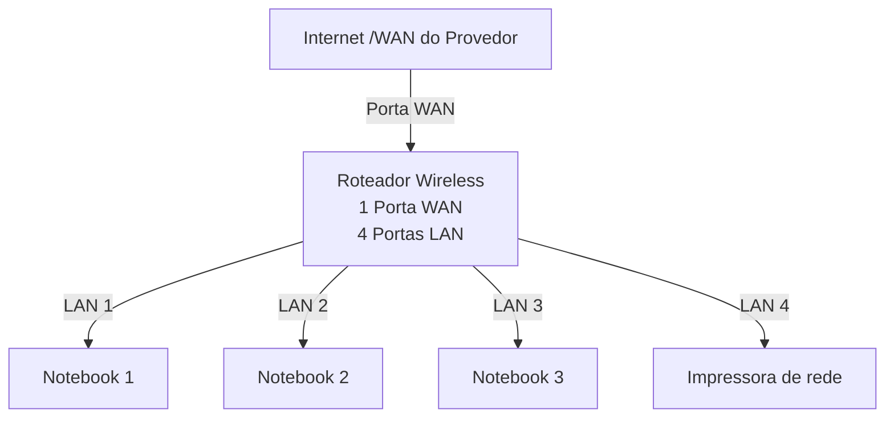

# Laboratori de Redes 01 - Projeto de Redes Local
Projeto Desenvolvido na Diciplina de Redes de Computadores no Curso Técnico em Informatica do SENAC

Aluno: kelli leni 

Professor: José de Assis

Data: 09/03/2026

---

## 1. Objetivo
Implementar uma rede local simples conectando 3 notebooks e um roteador wireless com switch 
Integrado a uma impressora de rede 

O projeto sera realizado em duas etapas 

1. Simulação da rede no Cisco Packet Tracer
2. Implementação da rede no Laboratorio real

---

## 2. Equipamentos utilizados neste laboratorio 

- 3 Notebook 
- 1 Roteador Wireless com 1 porta WAN e 4 portas LAN 
- 1 Impressora da rede
- cabos de rede

---

##3. Tripolagia de rede
diagrama lógica de rede utilizada nete laboratorio:

Imagem da topologia no Laboratorio 

---

## 4. Plano de endereço IP
Rede: 192.168.0.0/24

Geteway: 192.168.0.1

| dispositipo | Tipo de IP | Endereço IP | Observação |
|-------------|-------------|-------------|-------------|
| Roteador | Estatico | 192,168.0.1 | IP do reteador |
| PC1 | Reservado DHCP | 192.168.0.100 | IP Reservado pelo roteador |
| PC2 | DHCP | Automático | IP Atribuido pelo roteador |
| PC3 | DHCP | Automático | IP Atribuido pelo roteador |

 **Obersevação**

- A Impressora e um dos notebooks utilizam reserva DHCP
- O roteador sempre atribui o mesmo endereço IP a esse dispositivos.

---

## 5. Após a Instalação, a rede foi montada fisicamente no laboratório.

Etapas realizadas:

## 6. Conclusão

este laboratorio permitiu compreender o funcionamento de uma rede local simples, incluindo;

- Estrutura de uma rede doméstico ou de pequeno escritório 
- utilização de roteador com porta WAN e portas LAN
- Funcionamento do DHCP
- Comunicação entre dispositivos de rede local
- utilização de uma impressora de rede
- Compartilhamento de pastas na rede 

